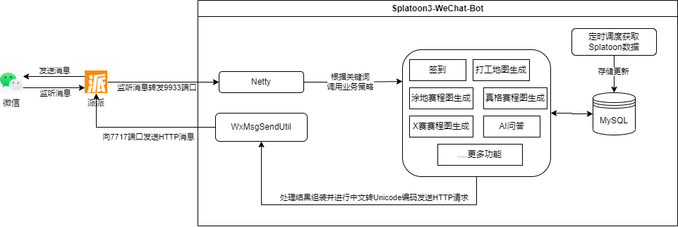
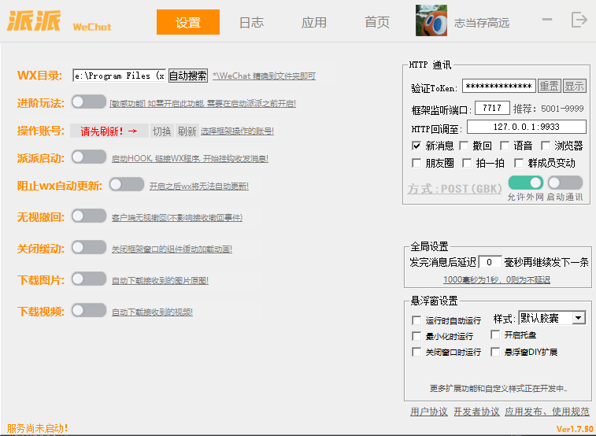

## 一、项目结构

### 1.1 微信Hook框架

采用“派派WeChat”框架监听微信消息。
官网：https://a.paipai.chat/

### 1.2 数据来源

Splatoon每日地图轮换数据来源于：https://splatoon3.ink/
通过HTTP请求定时获取JSON数据并解析存储于数据库。

### 1.3 项目结构



### 1.4 功能实现

微信消息的监听采用派派框架进行监听，然后将监听的消息回调到指定端口（默认9933）中，因此本项目主要实现的是监听消息转发到9933端口后的处理。

1、采用Netty框架监听9933端口，获取派派监听的消息后，进行解码消息处理，根据关键词转发业务策略到对应的策略处理类中进行业务处理。

#### 微信文本信息格式

```json
{
  "Type": 1,
  "Sender": 1,
  "MsgID": 84936,
  "Time": 1727168433,
  "Wxid": "123456@chatroom",
  "Talker": "wxid_123456789",
  "Content": "签到",
  "Path": "",
  "AtList": ""
}
```

2、处理后的结果通过HTTP请求发送消息到派派端口7713。

#### 派派API文档

https://apifox.com/apidoc/shared-395e4165-fcc7-4e8a-959a-a9e46521a890

3、定时抓取喷喷地图数据，采用Spring Boot框架进行定时任务配置，定时任务通过HTTP请求获取JSON数据并解析存储于数据库。

## 1.5 项目操作与部署

1、打开派派APP，登陆微信账号，启动HOOK，打开右侧“HTTP通讯”板块的“启动通讯”功能。


2、启动项目，监听9933端口

3、拉机器人微信进群，在群里发送。激活群组

## 二、项目版本说明

### V1.0版本

- 激活群聊
- 签到功能
- 查询真格信息
- 查询打工信息
- 查询涂地信息
- 查询X赛
- 查询祭典
- 接入文心一言AI功能

### V1.1版本

- 接入NSO

### V1.2版本

- 帮助功能
